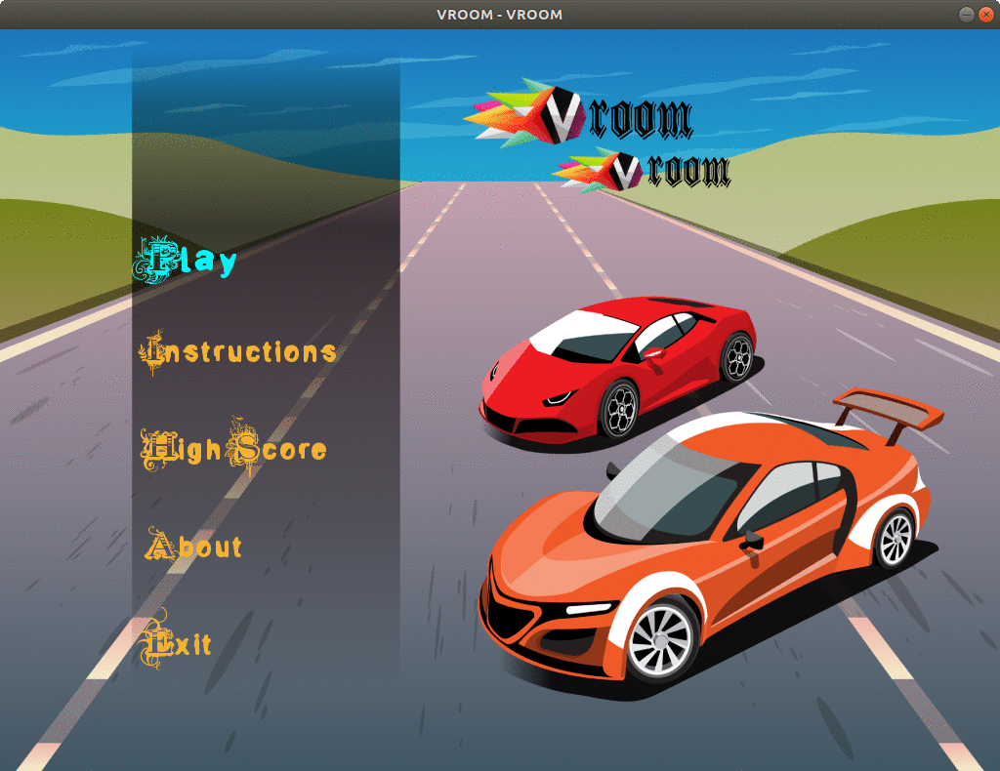

# VROOM-VROOM

## What is this?

Vroom Vroom is a **2.5D Car-Racing** game developed using C++.
The game is developed as a Final-Project for the course of Object Oriented Programming on third semester of Computer Engineering discipline of [TU ,Institute of Engineering](https://ioe.edu.np/). The project uses some good use of Object Oriented concept alongwith smooth graphics and gameplay.



### Built With

The game is implemented in C++.
It uses [SFML](https://www.sfml-dev.org/) as a graphics and audio library.

### Installation

On Linux

SFML installation

```bash
sudo apt update
sudo apt install libsfml-dev
```

After installation, browse to the directory where the project files are located.

Run the following command and enjoy the game.

```bash
  chmod +x game.sh 
./game.sh
```

## Developers

* Diwakar Gyawali
* Manoj Khatri
* Prajwal K. Pandey


